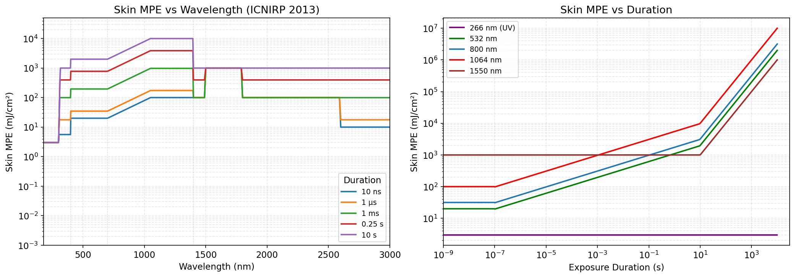

# Laser MPE Calculator — Skin

**Laser Maximum Permissible Exposure (MPE) Calculator for Skin**

A Python package for computing laser skin MPE values per ICNIRP 2013, with support for single-pulse, CW, and repetitive-pulse exposure regimes. Designed for researchers, laser safety officers, and engineers working in biophotonics (OCT, photoacoustic imaging, confocal microscopy), laser manufacturing, telecommunications, and any application requiring laser skin safety evaluation.

Associated with [OCT Research](https://octresearch.org/).

<p align="center">
  
</p>

<p align="center"><em>Left: Skin MPE vs wavelength for five exposure durations. Right: Skin MPE vs exposure duration for key laser wavelengths.</em></p>

---

## Features

- **Full wavelength coverage:** 180 nm to 1000 µm (UV through far infrared)
- **All exposure durations:** 10⁻⁹ s to 3×10⁴ s (nanoseconds to hours)
- **Exposure modes:** Single-pulse, continuous-wave (CW), and repetitive-pulse
- **UV dual-limit logic:** Automatically selects the lower of photochemical and thermal limits (180–400 nm)
- **C_A correction factor:** Wavelength-dependent correction for 400–1400 nm (Table 3)
- **Repetitive-pulse rules:** Rule 1 (single-pulse limit) and Rule 2 (average power), 
- **Supporting calculations:** T_max lookup, limiting apertures, large area correction, UV successive-day de-rating
- **Unit conversions:** J/cm², mJ/cm², W/cm², mW/cm², pulse energy, average power
- **Verified:** 330 automated checks against hand-computed values from the ICNIRP 2013 standard

## Standards Compliance

All values are verified against **ICNIRP 2013**. Every piecewise value, correction factor, and boundary condition has been checked against the published standard.

| Standard Reference | Content | Status |
|---|---|---|
| Table 7 | Skin MPE, all 6 wavelength bands | ✅ Verified |
| Table 3 | C_A correction factor | ✅ Verified |
| Table 4 | T_max for skin | ✅ Verified |
| Table 8 | Limiting apertures for skin | ✅ Verified |
| Repetitive pulse | Repetitive-pulse Rules 1 and 2 (Rule 3 excluded) | ✅ Verified |
| Large area | Large area exposure correction | ✅ Verified |
| UV de-rating | UV successive-day de-rating | ✅ Verified |

Boundary conventions follow the standard exactly: `t₁ ≤ t < t₂` and `λ₁ ≤ λ < λ₂`.


## Installation

```bash
git clone https://github.com/itgall/MPE-Calculator-Skin.git
cd MPE-Calculator-Skin
pip install -e ".[test]"
```

### Requirements

- Python ≥ 3.9
- NumPy ≥ 1.21

## Quick Start

### Single-pulse skin MPE

```python
from laser_mpe import H_skin_ICNIRP_MPE

# MPE at 532 nm, 10 ns pulse duration
H = H_skin_ICNIRP_MPE(532, 10e-9)
print(f"MPE = {H*1e3:.2f} mJ/cm²")  # 20.00 mJ/cm²

# MPE at 1064 nm, 10 ns pulse (CA = 5.0)
H = H_skin_ICNIRP_MPE(1064, 10e-9)
print(f"MPE = {H*1e3:.2f} mJ/cm²")  # 100.00 mJ/cm²
```

### Repetitive-pulse skin MPE

```python
import numpy as np
from laser_mpe import per_pulse_MPE

# Per-pulse MPE at 800 nm, 10 ns pulses, 1 s exposure, varying PRF
H_pulse, N = per_pulse_MPE(
    wl_nm=800,
    tau=10e-9,
    f_array=np.logspace(0, 4, 100),  # 1 Hz to 10 kHz
    T=1.0,
    
)
```

### Supporting calculations

```python
from laser_mpe import (
    get_Tmax_skin,
    get_skin_limiting_aperture,
    irradiance_from_radiant_exposure,
    radiant_exposure_convert,
)

# Recommended maximum exposure duration
Tmax = get_Tmax_skin(800)  # 600 s for NIR

# Limiting aperture for skin
ap = get_skin_limiting_aperture(800)
print(f"Aperture: {ap['diameter_mm']} mm, Area: {ap['area_cm2']:.4f} cm²")

# Convert units
H = 0.02  # J/cm²
print(f"{radiant_exposure_convert(H, 'mJ/cm2')} mJ/cm²")
```

## Testing

330 automated checks across 4 test suites, verified against hand-computed values from the standard:

```
Test Suite                                 Checks
──────────────────────────────────────────────────
test_skin_mpe                              39
test_skin_parameters                       32
test_correction_factors                    5
verify_exhaustive                          254
──────────────────────────────────────────────────
TOTAL                                      330
```

```bash
python tests/test_skin_mpe.py
python tests/test_skin_parameters.py
python tests/test_correction_factors.py
python tests/verify_exhaustive.py
```

Full test outputs are available in [`tests/outputs/`](tests/outputs/).

## Package Structure

```
MPE-Calculator-Skin/
├── src/laser_mpe/
│   ├── __init__.py              # Public API
│   ├── correction_factors.py    # C_A (Table 3)
│   ├── icnirp_skin.py          # Skin MPE (Tables 5 and 7)
│   ├── repetitive_pulse.py     # Rules 1 and 2
│   └── skin_parameters.py      # T_max, apertures, conversions
├── web/
│   ├── index.html               # Standalone interactive calculator
│   ├── calculator.jsx           # React component source
│   └── README.md                # Web deployment guide
├── tests/
│   ├── outputs/                 # Full test output logs
│   └── *.py                     # 4 test suites (330 checks)
├── examples/                    # Usage examples
├── docs/
│   ├── API.md                   # Complete API reference
│   └── images/                  # Figures
├── LICENSE                      # MIT
├── README.md
├── CONTRIBUTING.md
├── CITATION.cff
└── pyproject.toml
```

## Web Calculator

An interactive browser-based calculator is available in [`web/`](web/). Open `web/index.html` in any browser — no build step or server required. Features include single-pulse and repetitive-pulse calculations, safety comparison, multi-wavelength comparison with overlaid plots, dark/light theme, shareable URLs, and PDF export. See [`web/README.md`](web/README.md) for deployment options.

## Roadmap

- [x] ICNIRP 2013 skin MPE (all bands, 180 nm–1000 µm)
- [x] UV dual-limit logic
- [x] Repetitive-pulse Rules 1 and 2
- [x] T_max, limiting apertures, large area correction, UV de-rating
- [x] Unit conversions
- [x] 330-check test suite
- [x] Interactive web calculator
- [ ] JOSS paper submission

## Contributing

See [CONTRIBUTING.md](CONTRIBUTING.md) for guidelines.

## Citation

If you use this software, please cite it using [CITATION.cff](CITATION.cff).

## License

MIT — see [LICENSE](LICENSE).

## Disclaimer

This software is provided for research and educational purposes. Users should independently verify MPE calculations for safety-critical applications. This software does not replace the judgment of a qualified Laser Safety Officer (LSO).
